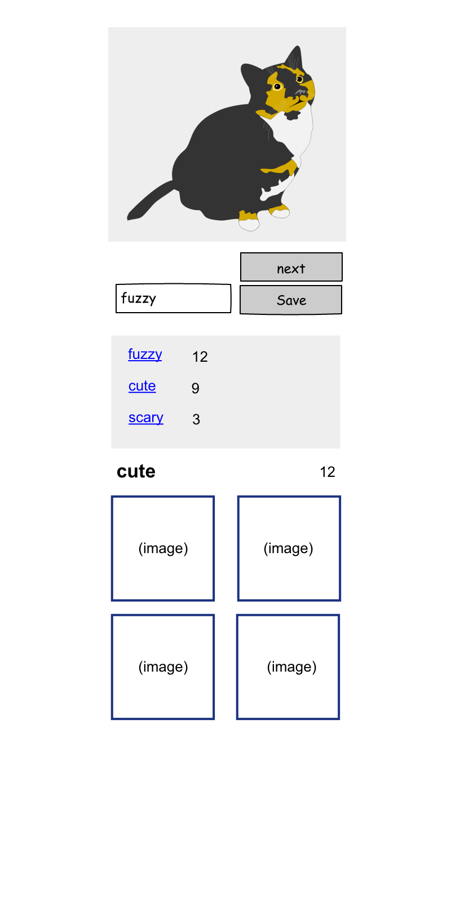

### Cat-egory Collector

Create a javascript application that connects to http://aws.random.cat to pull random cat images. 

- The page should show a random cat image on load
- There should be a button to fetch a new image
- There should be an input to label the image with a category, and a save button next to it
- There should be a list of all the categories saved so far
- If you click on a category, it should show a list of the all the cats saved in that category
- If you reload the page, or navigate back to the page, the previously saved cats and categories should still exist

### Stack
- Use a javascript Single Page Application (SPA) framework: e.g. React, Vue, Angular, Ember, etc.
- Use bootstrap (and your own styles css)
- no backend other than the cat api. Site should be static, only clientside javascript

### Deliverables
- full application code
- image of the project
- a link to the deployed project (github pages is a nice free option)

### Mock up

This project was bootstrapped with [Create React App](https://github.com/facebook/create-react-app).

## Available Scripts

In the project directory, you can run:

### `npm start`

Runs the app in the development mode. 
Open [http://localhost:3000](http://localhost:3000) to view it in the browser.

The page will reload if you make edits. 
You will also see any lint errors in the console.

### `npm run build`

Builds the app for production to the `build` folder. 
It correctly bundles React in production mode and optimizes the build for the best performance.

The build is minified and the filenames include the hashes. 
Your app is ready to be deployed!

See the section about [deployment](https://facebook.github.io/create-react-app/docs/deployment) for more information.

